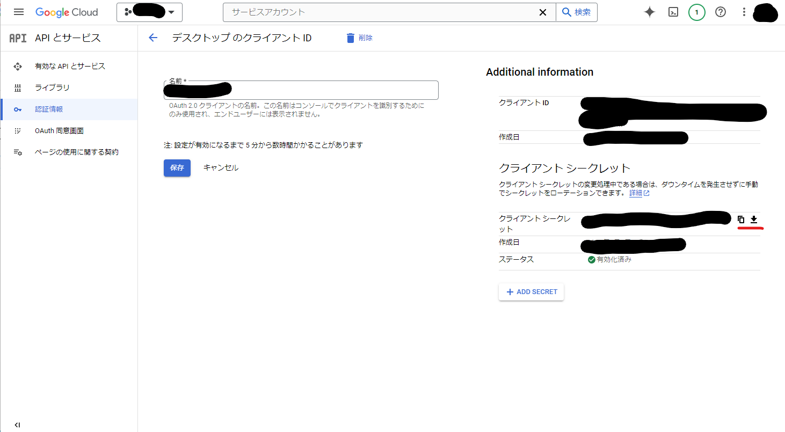

# ブログ管理

## ブログのURL

[3930kmのいっぽめ(https://first-step-of-3930.blog.uttne.net/)](https://first-step-of-3930.blog.uttne.net/)

## Secret の保存と暗号化について

このプログラムを実行する場合は、 `client_secret.json` が必要になる。  
ただし、ローカルにそのまま `client_secret.json` を保存するとセキュリティ上よくないので暗号化を行い `client_secret.json.enc` を生成し、それを実行時に使用する。  
以下は `client_secret.json.enc` を作成するための手順となる。  

1. .env に暗号化のためのパスフレーズを設定

`client_secret.json.enc` を生成するためのパスフレーズを指定する。  
これはローカル環境毎に任意の値を設定する。  

```ini
# これに暗号化のためのパスフレーズを設定する
# またはPCの環境変数に設定をする
BLOGGER_SECRET_ENCRYPT_PASSPHRASE=
```

2. Client Secret を保存する

Google Cloud の API とサービスにある認証情報に登録されているクライアントIDを選択し、クライアントシークレットをダウンロードし `client_secret.json` という名前で保存する。



3. 暗号化ファイルを作成する

以下を実行する。

```bash
pipenv run encrypt
```

これを実行することで `client_secret.json.enc` が作成される。  
作成後は `client_secret.json` は削除しても問題ない。

## Usage

```bash
pipenv install --dev
```

```bash
# 新しい記事を作成する
pipenv run new

# 記事をアップロードする
pipenv run up
```

## style

コードハイライトを使用するために Python-Markdown の [Fenced Code Blocks](https://python-markdown.github.io/extensions/fenced_code_blocks/) と [CodeHilite](https://python-markdown.github.io/extensions/code_hilite/index.html) を使用する。

CodeHilite で使用する css は以下の出力することができるので Blogger のテーマを編集してこの css を head に書き込む。

```bash
py -m pygments -S default -f html -a .codehilite > styles.css
```

## API リファレンス

- [Blogs: listByUser &nbsp;|&nbsp; Blogger &nbsp;|&nbsp; Google Developers](https://developers.google.com/blogger/docs/3.0/reference/blogs/listByUser)
