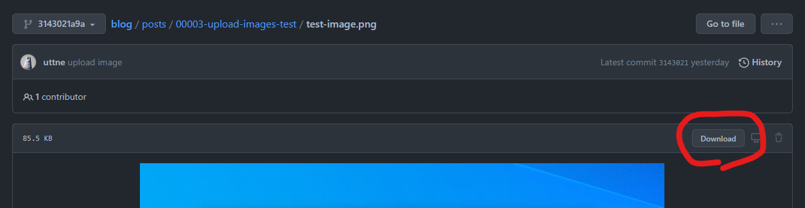

<!--
blog-meta-data
title: ブログの投稿スクリプトと画像
tags: 雑記,python
-->

## Blogger API での画像

Blogger に記事を投稿する際、画像を一緒に投稿できたら便利だなーと Blogger の API を確認してみましたが、残念ながら画像を投稿できそうな API が見つかりませんでした。

どうも調べてみると Blogger の画像自体は [Google アルバム アーカイブ](https://get.google.com/albumarchive) に保存されているよう。

別の話になりますが、 Blogger のエディターを使ってアップロードした画像を消したくなったときはここから消せばよさそうです。

多分 Google の別のサービス (Google フォト?) の API を使用すれば多分同じことができるのだと思いますが、記事のソースである Markdown と画像が GitHub と Google アルバム アーカイブ に別れて管理されるのは美しくないので画像も GitHub に管理することにしました。

## GitHub の画像の参照

GitHub のレポジトリに画像をアップロードするとその画像を参照する URL を発行してくれます。  
今回はその URL をブログの記事に埋め込んで画像を表示しようと思います。

コミットした画像はその際のハッシュとリポジトリ内のパスを使って参照する URL を求めることができます。

例えばこのブログのソースを管理しているレポジトリのある画像は、以下のパラメータを組み合わせて画像のデータを参照する URL が次のように求まります。

### パラメータ

| パラメータ                         | 値                                            |
| ---------------------------------- | --------------------------------------------- |
| GitHub のレポジトリの URL          | https://github.com/uttne/blog.git             |
| 画像をコミットしたときのハッシュ値 | 3143021a9a16cb5a66b0125fdd6a77e86039cb87      |
| リポジトリ内の画像のパス           | posts/00003-upload-images-test/test-image.png |

### 求められる URL

[https://raw.githubusercontent.com/uttne/blog/3143021a9a16cb5a66b0125fdd6a77e86039cb87/posts/00003-upload-images-test/test-image.png](https://raw.githubusercontent.com/uttne/blog/3143021a9a16cb5a66b0125fdd6a77e86039cb87/posts/00003-upload-images-test/test-image.png)

`raw.githubusercontent.com` は GitHub の生データにアクセスするためのドメインになります。

因みにコミットをたどって [この画像の表示画面](https://github.com/uttne/blog/blob/3143021a9a16cb5a66b0125fdd6a77e86039cb87/posts/00003-upload-images-test/test-image.png) にいくと以下のような Download ボタンが表示されます。

この Download ボタンのリンクをコピーすると以下の URL が取得できます。  

[https://github.com/uttne/blog/raw/3143021a9a16cb5a66b0125fdd6a77e86039cb87/posts/00003-upload-images-test/test-image.png](https://github.com/uttne/blog/raw/3143021a9a16cb5a66b0125fdd6a77e86039cb87/posts/00003-upload-images-test/test-image.png)

取得した URL にアクセスすると上記で求めた URL にリダイレクトされます。

因みにこの URL をそのまま Blogger の記事に貼っても普通に画像は表示されました。

## Python で上記の URL を求める

GitHub に画像をアップロードすれば Blogger から参照しても表示されることがわかったので Python を使い、上記のような URL を計算する処理を書きました。  
求めた URL で Markdown からの相対参照で書かれていた画像のパスを置換し、その新しい Markdown を HTML に変換するように処理を変更しました。

簡単な流れは以下のようになります。

1. Markdown で記事を書く
2. 画像をレポジトリ内に保存し Markdown から相対参照する
3. 記事と画像をコミットする
4. [GitPython](https://gitpython.readthedocs.io/en/stable/index.html) を使って remote origin から GitHub のリポジトリの URL を求める
5. 対象の Markdown を解析して画像のリポジトリ内でのパスを取得する
6. GitPython を使い取得した画像のハッシュ値を取得する
7. 集めたパラメータから画像参照用の URL を求める
8. Markdown から HTML の変換をする前処理として Markdown の中の画像相対パスを求めた URL に置換する
9. Markdown を HTML に変換して API でブログに投稿する
10. ローカルのコミットは全て remote に push する

実際の処理の場所は [ここ](https://github.com/uttne/blog/blob/f6eb41b443528117ee9c7b3f99f3cffec108fd8d/blog/modules/blog_manager.py#L61-L114) になります。

これでようやく最低限ブログを書く準備ができたので、ブログの自動化以外の話題も少しずつ頑張って書いていこう思います。

## 参考

- [Google Bloggerの画像はどこにあるの？どうやって削除するの？](https://8oclockis.blogspot.com/2020/09/google-blogger.html)
