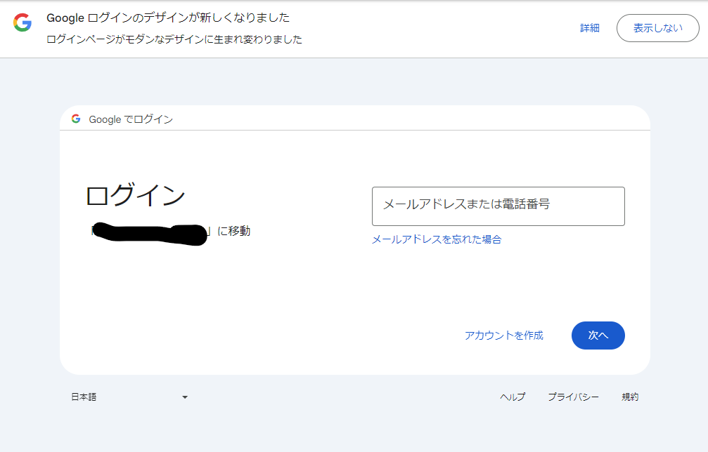
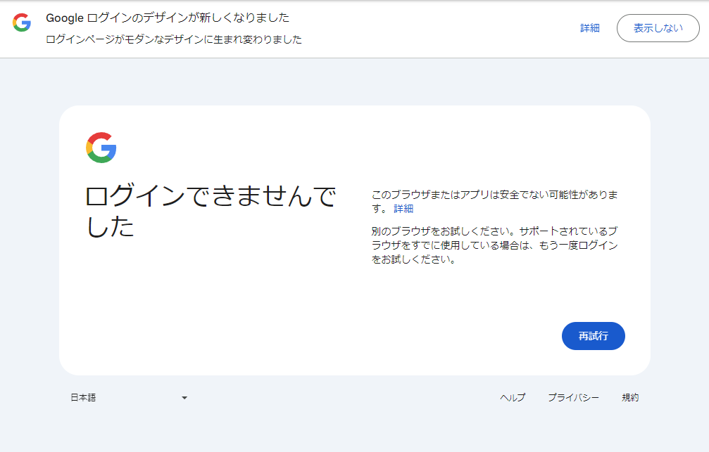
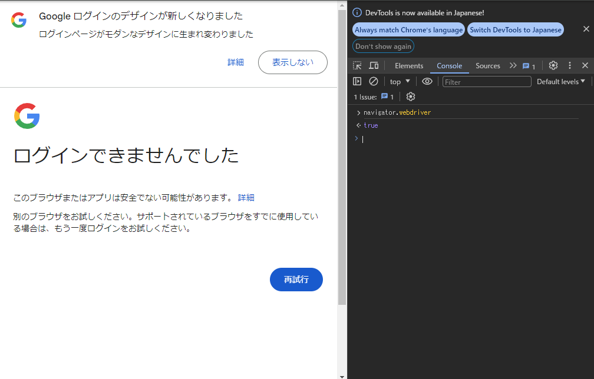
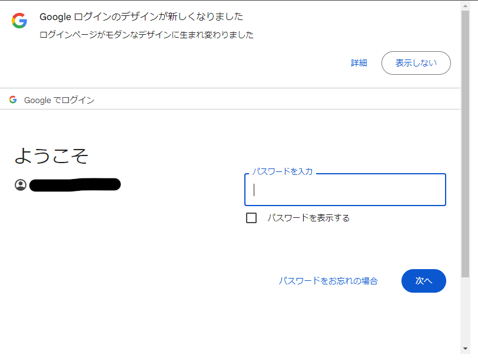
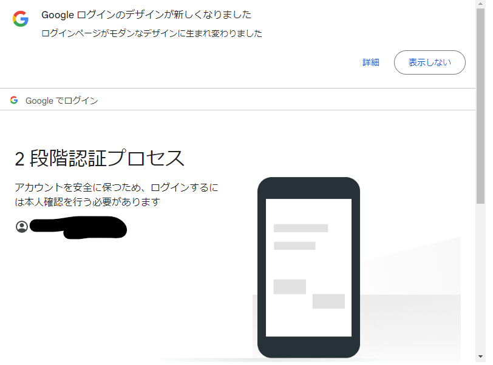
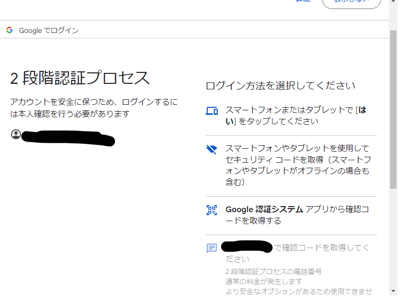
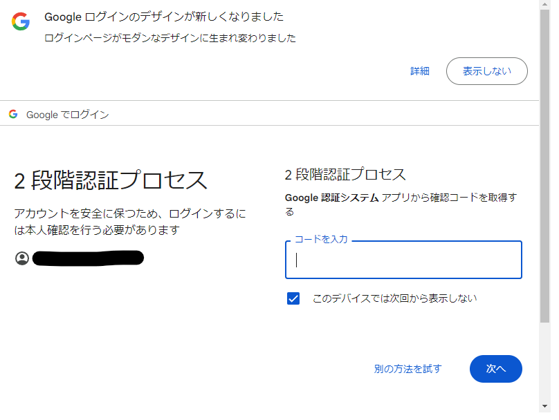

<!--
blog-meta-data
title: Blogger のアップロードを完全自動化しようとしてやめた話
tags: Blooger,雑記,Python
-->

## 現在の Blogger の記事の更新方法

現在記事のソースは [GitHub](https://github.com/uttne/blog) で管理ししており、記事の追加や更新は Python でスクリプトを組んで Blogger の API で行っている。

この方法は [ここ](https://developers.google.com/blogger/docs/3.0/using?hl=ja) に記載されている方法に習って行っているが、 OAuth 2.0 でトークンを取得しているためトークンの期限が切れるとブラウザでアプリケーションの同意をするマニュアル操作が必要になる。  
そのため GitHub Actions で push をトリガーにして blog を更新するといった完全自動化ができていない。

## 完全自動化はできるのか?

多分できる...と思う。  
ただあまりメリットがなさそうだったので今の方法で継続することにした。

## 完全自動化するには何が課題か

Google の認証を突破してトークンを自動で生成することが必要。

これを実現するするためにはブラウザの操作の自動化が必要なので、そのためのツールを検索すると以下のようなものが候補になる。

| No. | ツール                                | 説明                                                                                                                                                                                        |
| --- | ------------------------------------- | ------------------------------------------------------------------------------------------------------------------------------------------------------------------------------------------- |
| 1   | [Selenium](https://www.selenium.dev/) | 言わずと知れたブラウザの自動化を行うためのツール<br>テストの自動化などでよく用いられる                                                                                                      |
| 2   | RPA                                   | Robotic Process Automateion の略<br>GUIなどで行うパソコンの操作を記録して自動化することができるので事務系の仕事の自動化でよく使われる<br>Microsoft の Power Automate for Desktop などな有名 |
| 3   | [Puppeteer](https://pptr.dev/)        | Selenium と同じようにブラウザの自動化を行うためのツール<br>Seleniumとは違いChromiumに特化している<br>nodeでスクリプトを書くことができいろいろ細かい設定ができるらしい                       |

RPA はとっつきやすいツールではあるが GitHub Actions では使えないので始めから除外する。  

そうすると一番初めに候補に挙がるのは Python で使える Selenium なので試してみた。

Selenium で Google の認証画面を表示するために Blogger の認証画面を表示するソース部分を以下のように編集する。

```python
if not credentials or not credentials.valid:
    if credentials and credentials.expired and credentials.refresh_token:
        credentials.refresh(Request())
    else:
        credentials = flow.run_local_server(
            # ブラウザを開くように設定していたものを
            # host="localhost", port=28080, open_browser=True, timeout_seconds=60
            
            # ブラウザ自体は勝手に開かず、コンソールにアクセスするURLが表示されるように変更する
            host="localhost", port=28080, open_browser=False
        )
    with open(credentialCacheFile, "wb") as f:
        pickle.dump(credentials, f)
```
[blog/modules/blogger.py#L52-L60](https://github.com/uttne/blog/blob/dc3f06711bd79bafaeac7654595664b91017e23e/blog/modules/blogger.py#L52-L60)

これでどこにアクセスをすればいいかがわかるので Selenium を使って表示をするために以下のようなコードを書いてみる。

```python
from selenium import webdriver

service = webdriver.ChromeService(
    executable_path="./chromedriver-win64/chromedriver.exe"
)

options = webdriver.ChromeOptions()

options.binary_location = "./chrome-win64/chrome.exe"

driver = webdriver.Chrome(options=options, service=service)

url = "${ここに認証ページのURLを張り付け}"
driver.get(url)

# ページが閉じないようにする
input()

driver.quit()
```

chrome本体とドライバーは以下からダウンロードする。  
[Chrome for Testing availability](https://googlechromelabs.github.io/chrome-for-testing/)

これを実行すると以下のような画面が表示されるのでメルアドを入力して「次へ」に行ってみる。



そうすると以下のような画面になってしまいログインができないといわれてしまう。



これについて調べてみると `navigator.webdriver` という値が `true` になっていることを判定して Google はログインできないようにしているらしい。



一応 Selenium でもこのフラグを削除する方法があるらしいがうまくできなかったので、簡単にできるらしい Puppeteer を試してみた。

以下のコードで `navigator.webdriver` を除去できる。
```javascript
const puppeteer = require("puppeteer");
const readline = require("readline/promises");

(async () => {
  const browser = await puppeteer.launch({
    headless: false,
  });
  const page = await browser.newPage();
  
  // この設定で navigator.webdriver を除去できる
  await page.evaluateOnNewDocument(() => {
    Object.defineProperty(navigator, "webdriver", () => {});
    delete navigator.__proto__.webdriver;
  });

  const url = "${ここに認証ページのURLを張り付け}";
  await page.goto(url);

  // 待機ように標準入力のインターフェースを用意
  const readInterface = readline.createInterface({
    input: process.stdin,
    output: process.stdout,
  });

  await readInterface.question("待機");

  await browser.close();
})();

```

実際に動かしてみると以下のようにパスワードの入力画面まで進むことができる。



ただ、パスワードを突破すると二段階認証の確認が入る。



これも自動化する方法がないかを考えると「別の方法を試す」で「Google 認証システムアプリから確認コードを取得する」が選択できるので



以下のような画面で6桁のコードを入力できれば自動で認証が完了できそうだということがわかる。



この認証コードは QR コードで取得できる secret key さえわかってしまえば計算で求めることができる。  
そのため新たに二段階認証をセットアップし、 secret key を保存してしまえば二段階認証まで突破することができるのでアクセストークンを完全自動で取得できそうだということが分かった。

## 完全自動化をしなかった理由

何となくできそうだということが分かったが結局以下の理由で行わなかった。
- 今回の自動化が Google さんに見つかったとき今使っているアカウントをバンされる可能が0ではないため
- 結局ブログを書くのは手作業でその都度コマンドを実行するのはさほど面倒ではないため

結局やれたとしてもコスパが見合わなそうだという結論になったのでこのブログの更新は今の方式で今後も続けて行くと思います。

ただ、将来にどうしても自動化を行わなければならないことがあるかもしれないのでメモとして残しておきます。

## 参考にさせていただいたサイト
- [Seleniumでnavigator.webdriverの対策をしてアクセスする - Qiita](https://qiita.com/r_ishimori/items/4ed251f0d166d5c9cee1)
- [Puppeteer の使い方](https://vicugna-pacos.github.io/puppeteer/how-to/)
- [2段階認証コードを計算するプログラムを書いてみた - Qiita](https://qiita.com/waaaaRapy/items/8549890bda4f8ad33963)
